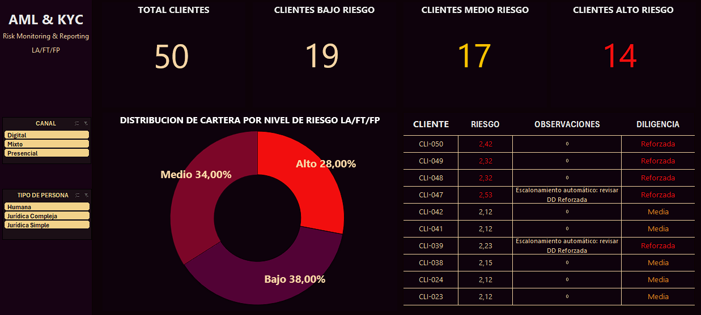

# Matriz de Riesgo LA/FT/FP — Enfoque Basado en Riesgo
**Portfolio AML/KYC  · Ejercicio con datos simulados**

## Descripción

Este proyecto construye una Matriz de Clasificación de Riesgo de Clientes bajo el 
Enfoque Basado en Riesgo (EBR) exigido por la Resolución UIF N° 14/2023 y sus 
modificatorias (Res. 56/2024, 199/2024, 78/2025, 3/2026). Evalúa 50 perfiles 
simulados sobre cuatro factores de riesgo ponderados y determina el nivel de debida 
diligencia aplicable a cada cliente. El objetivo es demostrar la capacidad de 
traducir un marco normativo en una herramienta operacional reproducible.

---

## Marco normativo aplicado

| Norma | Artículos clave | Enlace |
|---|---|---|
| Res. UIF N° 14/2023 (texto consolidado) | Art. 1°, 3°, 4°, 22-25, 27, 28 | [Ver texto](https://trivia.consejo.org.ar/ficha/521070-resolucion_uif_n_142023_entidades_financieras_y_cambiarias_texto_ordenado) |
| Res. UIF N° 56/2024 | Modificaciones generales | [Ver en BO](https://www.boletinoficial.gob.ar) |
| Res. UIF N° 199/2024 | Incorporación riesgo FPADM; Art. 27 umbral SMVM | [Ver en BO](https://www.boletinoficial.gob.ar) |
| Res. UIF N° 78/2025 | Canal no presencial (Art. 26) | [Ver texto](https://trivia.consejo.org.ar/ficha/525472) |
| Res. UIF N° 3/2026 | Cotejo listas FPADM; plazo 24 hs congelamiento | [Ver en BO](https://www.boletinoficial.gob.ar/detalleAviso/primera/337241/20260108) |

---

## Contenido del repositorio

| Archivo | Descripción | Formato |
|---|---|---|
| `matriz/matriz_riesgo_50_clientes.xlsx` | Matriz principal con 50 perfiles, fórmulas y semáforo de riesgo | Excel |
| `metodologia/metodologia_ebr_res14_2023.pdf` | Documento metodológico completo | PDF |
| `dashboard/captura_pagina_operacional.png` | Vista operacional del dashboard Excel | PNG |
| `dashboard/matriz_riesgo_50_clientes.xlsx` | Archivo fuente Excel | xlsx |
| `infografia/factores_riesgo_linkedin.png` | Infografía con el flujo del EBR | PNG |
| `normativa/corpus_normativo_citado.md` | Compendio de normas citadas con artículos y URLs | Markdown |
| `imagenes_preview/preview_matriz.png` | Captura de pantalla de la matriz | PNG |

---
## Captura del dashboard

### Página 1 — Vista Operacional Excel (Analista)

---
## Cómo navegar el proyecto

1. **Empezá por el metodológico** (`metodologia/`) — explica la lógica de ponderación y la regla de escalonamiento automático
2. **Abrí la matriz** (`matriz/`) — los resultados de los 50 clientes con semáforo de riesgo y pestaña de resumen ejecutivo
3. **Explorá el dashboard** (`dashboard/`) — las capturas muestran la vista operacional ; el `.xlsx` permite interactividad completa en Excel

---

## Limitaciones

Todos los datos de clientes utilizados en este proyecto son ficticios y fueron 
generados exclusivamente con fines educativos. Los resultados no representan una 
cartera real ni la política de prevención de lavado de activos de ninguna entidad 
financiera. La metodología de ponderación es propia de este ejercicio y no ha sido 
validada por ninguna autoridad regulatoria.

---

## Autor

**Joel Kraft** · https://www.linkedin.com/in/kraft-joel-analytics/
